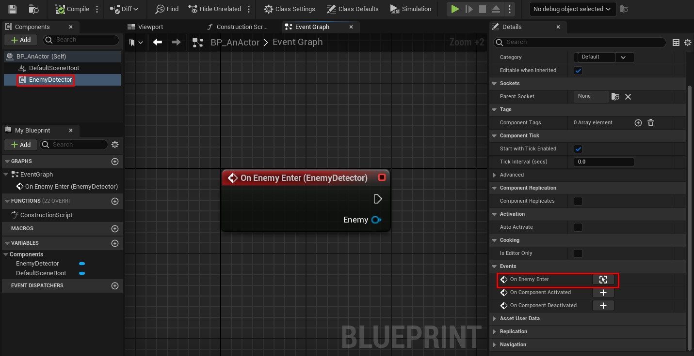

Event dispatchers in NimForUE allow you to create events that can be easily subscribed to in Blueprints. This is useful for creating modular and extensible gameplay systems.

## Defining the Delegate

First, define your delegate type using the `uDelegate` macro:

```nim
uDelegate FOnEnemyEnterDelegate(enemy: AActorPtr)
```

This creates a [multicast delegate](https://dev.epicgames.com/documentation/en-us/unreal-engine/multicast-delegates-in-unreal-engine) type that takes an `AActorPtr` (representing the enemy) as a parameter.

## Adding the Event Dispatcher to Your Class

In your class definition, use the `uprop` macro with the `BlueprintAssignable` specifier to create the event dispatcher:

```nim
uClass UEnemyDetector of UActorComponent:
  (BlueprintType, Blueprintable, BlueprintSpawnableComponent)
  
  uprops(BlueprintAssignable):
    onEnemyEnter: FOnEnemyEnterDelegate
```

## Creating a Function to Trigger the Event

To make it more accessible in Blueprints, add a function to trigger the event:

```nim
ufuncs(BlueprintCallable):
  proc triggerEnemyEnterEvent(enemy: AActorPtr) =
    self.onEnemyEnter.broadcast(enemy)
```

## Complete Example

Here's a complete example combining all the steps:

```nim
uDelegate FOnEnemyEnterDelegate(enemy: AActorPtr)

uClass UEnemyDetector of UActorComponent:
  (BlueprintType, Blueprintable, BlueprintSpawnableComponent)
  
  uprops(BlueprintAssignable):
    onEnemyEnter: FOnEnemyEnterDelegate
  
  ufuncs(BlueprintCallable):
    proc triggerEnemyEnterEvent(enemy: AActorPtr) =
      self.onEnemyEnter.broadcast(enemy)
```

